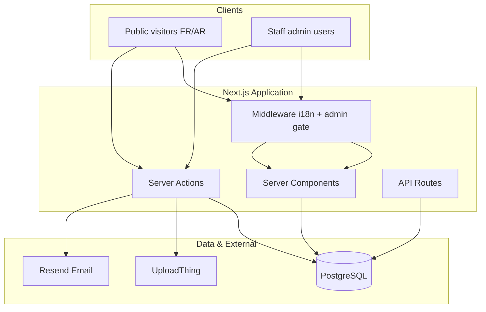
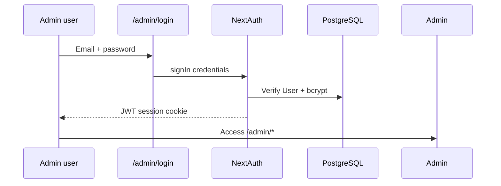
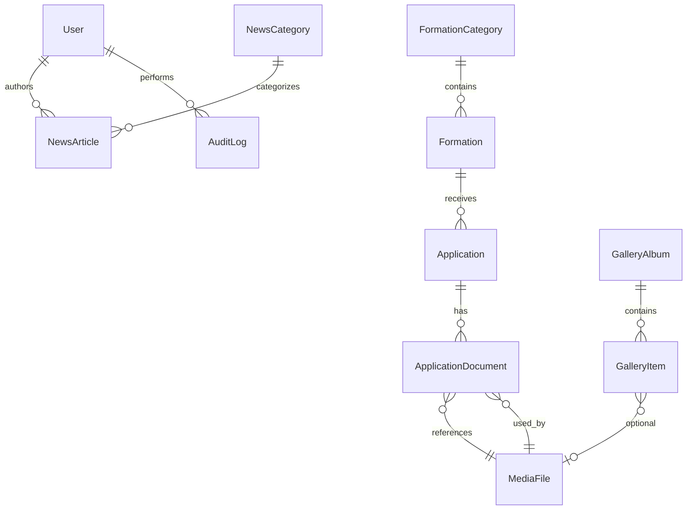
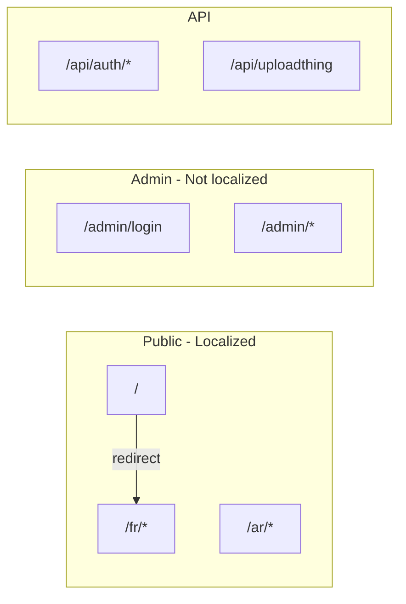
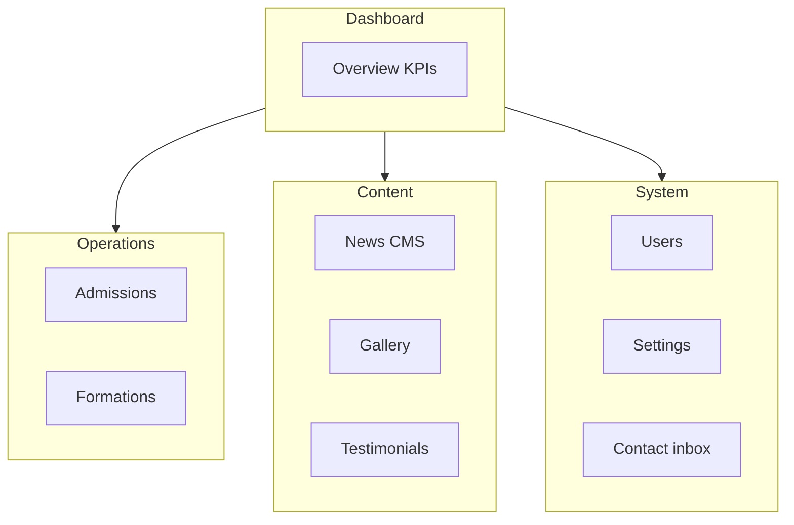
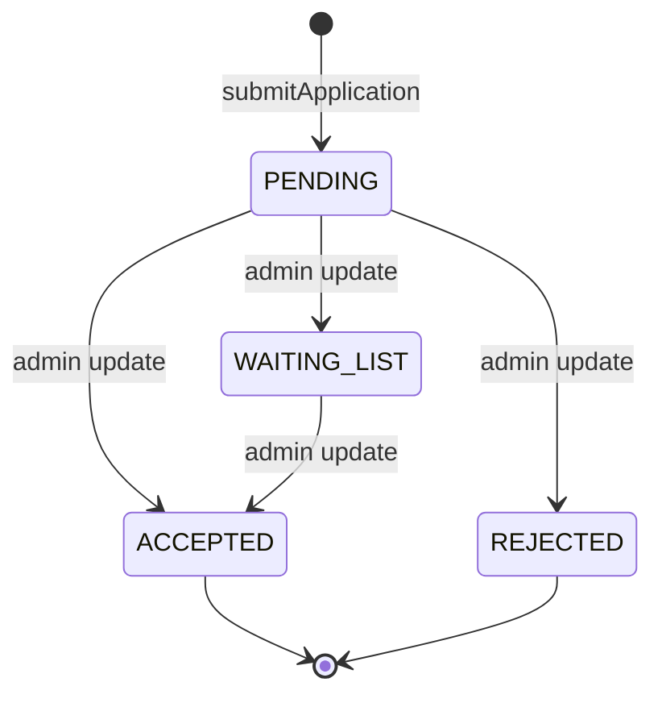
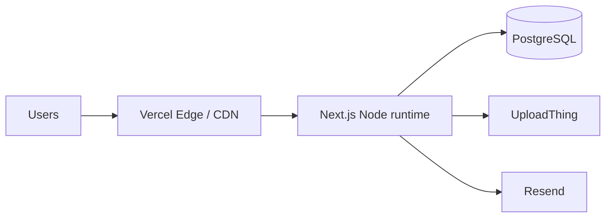

# CQPM Nador — Software Architecture Document

**Centre de Qualification Professionnelle Maritime de Nador**

| Field | Value |
|-------|--------|
| Version | 1.0 |
| Status | Living document (aligned with codebase v1.0) |
| Stack | Next.js 15, TypeScript, PostgreSQL, Prisma, NextAuth v5 |
| Last reviewed | June 2026 |

---

## 1. Executive Summary

CQPM Nador is a bilingual (French / Arabic) institutional web platform combining a **public marketing and admissions website** with a **role-based admin back-office**. The system supports online registration with document uploads, application status tracking, a news CMS, media gallery, and centralized site configuration.

The architecture follows a **layered monolith** on Next.js App Router: Server Components for read-heavy pages, Server Actions for mutations, a thin API surface for auth and file uploads, and a service layer between UI and Prisma.



---

## 2. Business Requirements

### 2.1 Organizational Context

CQPM Nador trains and qualifies maritime professionals (fishermen, navigators, related trades). The platform must:

- Present the institution professionally (inspired by peer sites such as ITPM Larache, with distinct branding and UX).
- Digitize **admission workflows** that were historically paper-based.
- Publish **news and media** without developer intervention.
- Operate in **French and Arabic**, including RTL layout for Arabic.

### 2.2 Stakeholders

| Stakeholder | Interest |
|-------------|----------|
| Prospective students / families | Discover formations, apply online, track application status |
| CQPM administration | Review applications, manage content, configure site |
| Communication / editorial staff | Publish news, gallery, testimonials |
| IT / management | Security, auditability, maintainability, SEO |

### 2.3 Functional Requirements

#### Public website

| ID | Requirement | Priority |
|----|-------------|----------|
| BR-P01 | Home page: hero, about teaser, formations overview, key figures, news, testimonials, gallery teaser, partners, contact CTA | Must |
| BR-P02 | About: history, presentation, mission, vision, values, gallery | Must |
| BR-P03 | Formations catalog by category (Qualification, Spécialisation, Formation Continue) with detail pages | Must |
| BR-P04 | Online admission: personal data, formation choice, CIN / diploma / photo uploads | Must |
| BR-P05 | Application status lookup by CIN (Pending, Accepted, Rejected, Waiting List) | Must |
| BR-P06 | News: categories, articles, featured, search, pagination | Must |
| BR-P07 | Gallery: albums, photos, videos | Must |
| BR-P08 | Contact: form, map embed, email notification to institution | Must |
| BR-P09 | Language switcher FR ↔ AR with persisted preference | Must |
| BR-P10 | Mobile-first, accessible (WCAG-oriented) UI | Must |

#### Administration

| ID | Requirement | Priority |
|----|-------------|----------|
| BR-A01 | Authenticated admin area with role-based access | Must |
| BR-A02 | User management (SUPER_ADMIN) | Must |
| BR-A03 | Admissions list and status updates with audit trail | Must |
| BR-A04 | Formation and category CRUD | Must |
| BR-A05 | News CMS with rich text (FR/AR) | Must |
| BR-A06 | Gallery albums and items management | Must |
| BR-A07 | Testimonials management | Must |
| BR-A08 | Contact message inbox | Must |
| BR-A09 | Site settings (contact, about blocks, stats, social, hero/logo) | Must |
| BR-A10 | Partners management | Should |

### 2.4 Non-Functional Requirements

| Category | Requirement |
|----------|-------------|
| Performance | Server Components, image optimization, minimal client JS on content pages |
| Security | RBAC, hashed passwords, rate limits on public forms, audit logs for sensitive actions |
| Availability | Stateless app tier; PostgreSQL as single source of truth |
| i18n | All user-facing strings via dictionaries; DB content bilingual (Fr/Ar columns) |
| SEO | Per-locale metadata, Open Graph, sitemap, robots |
| Maintainability | Feature-based folders, shared services, Zod validation at boundaries |

### 2.5 Out of Scope (v1)

- Student portal / LMS
- Payment processing
- Multi-tenant (other maritime centers)
- Native mobile apps
- Public user accounts (only staff authenticate)

---

## 3. User Roles and Permissions

### 3.1 Role Model

Three hierarchical staff roles are stored on `User.role`:

| Role | Level | Description |
|------|-------|-------------|
| `SUPER_ADMIN` | 3 | Full system control: users, settings, all content |
| `ADMIN` | 2 | Operations: admissions, formations, testimonials, contact; read settings |
| `EDITOR` | 1 | Content: news, gallery; read-only on formations |

Public visitors are **unauthenticated**; they interact via Server Actions only (no session).

### 3.2 Permission Matrix

Resources map to `PERMISSIONS` in `src/lib/auth/rbac.ts`:

| Resource | Read | Write |
|----------|------|-------|
| `users` | SUPER_ADMIN, ADMIN | SUPER_ADMIN |
| `admissions` | SUPER_ADMIN, ADMIN | SUPER_ADMIN, ADMIN |
| `formations` | SUPER_ADMIN, ADMIN, EDITOR | SUPER_ADMIN, ADMIN |
| `news` | SUPER_ADMIN, ADMIN, EDITOR | SUPER_ADMIN, ADMIN, EDITOR |
| `gallery` | SUPER_ADMIN, ADMIN, EDITOR | SUPER_ADMIN, ADMIN, EDITOR |
| `testimonials` | SUPER_ADMIN, ADMIN, EDITOR | SUPER_ADMIN, ADMIN |
| `contact` | SUPER_ADMIN, ADMIN | SUPER_ADMIN, ADMIN |
| `settings` | SUPER_ADMIN, ADMIN | SUPER_ADMIN |

**Enforcement layers:**

1. **Middleware** — Admin routes (except `/admin/login`): requires session cookie presence.
2. **Page/layout** — `auth()` + `hasPermission()` redirect if unauthorized.
3. **Server Actions** — Must re-check role on every mutation (defense in depth).

### 3.3 Authentication Flow (Staff)



- Provider: Credentials only (v1).
- Session: JWT, 8-hour max age.
- Adapter: Prisma (Account/Session tables reserved for future OAuth).

---

## 4. Database Design

### 4.1 Technology

- **PostgreSQL 15+**
- **Prisma ORM** — schema in `prisma/schema.prisma`
- Identifiers: `cuid()` for primary keys
- Bilingual content: parallel `*Fr` / `*Ar` columns (no JSON i18n blob for CMS text)

### 4.2 Entity-Relationship Overview



### 4.3 Core Entities

#### Identity & auth

| Table | Purpose |
|-------|---------|
| `users` | Staff accounts: email, passwordHash, role, isActive |
| `accounts` | NextAuth OAuth linkage (future) |
| `sessions` | NextAuth DB sessions (optional with JWT) |
| `verification_tokens` | NextAuth email flows (reserved) |

#### Training & admissions

| Table | Purpose |
|-------|---------|
| `formation_categories` | Qualification / Spécialisation / Formation Continue |
| `formations` | Bilingual program details, slug, publish flag |
| `applications` | Candidate dossier + `ApplicationStatus` |
| `application_documents` | CIN, DIPLOMA, PHOTO → `media_files` |

**Application status enum:** `PENDING` → `ACCEPTED` | `REJECTED` | `WAITING_LIST`

**Indexes:** `applications.cin`, `applications.status`, `formations.categoryId`

#### Content

| Table | Purpose |
|-------|---------|
| `news_categories` | Bilingual category names |
| `news_articles` | Full CMS article, featured flag, views counter |
| `gallery_albums` | Album metadata + cover |
| `gallery_items` | PHOTO (MediaFile) or VIDEO (external URL) |
| `testimonials` | Bilingual quotes, rating, order |
| `partners` | Logo, website, publish flag |

#### System

| Table | Purpose |
|-------|---------|
| `media_files` | Central file registry (URL, mime, size, UploadThing key) |
| `contact_messages` | Inbound public messages, `isRead` |
| `site_settings` | Singleton row `id = "default"` for global copy and stats |
| `audit_logs` | Who did what, when, on which entity |

### 4.4 Site Settings Singleton

One row drives public branding and about content:

- Names, taglines (FR/AR)
- Contact: email, phone, addresses
- About blocks: history, presentation, mission, vision, values
- Stats: students, formations, years, partners (display counters)
- Social URLs, hero image, logo

### 4.5 Data Integrity Rules

| Rule | Implementation |
|------|----------------|
| One document type per application | `@@unique([applicationId, type])` on `application_documents` |
| Unique formation/news slugs | Unique indexes for SEO URLs |
| Cascade delete | Documents and gallery items cascade with parent |
| Soft publish | `isPublished` flags on formations, albums, testimonials, partners |

### 4.6 Planned Schema Enhancements (Roadmap)

| Enhancement | Rationale |
|-------------|-----------|
| `applications.reviewedById` → `User` | Accountability on status changes |
| `@@unique([cin, formationId])` | Prevent duplicate applications (specified in original BR) |
| `partners` admin CRUD | BR-A10 |
| Full-text search index | News search at scale |

---

## 5. Folder Structure

Enterprise layout under `src/`:

```
cqpm/
├── prisma/
│   ├── schema.prisma          # Data model
│   ├── seed.ts                # Dev/staging seed
│   └── migrations/            # Versioned SQL (to be applied)
├── docs/
│   └── ARCHITECTURE.md        # This document
├── public/                    # Static assets
├── src/
│   ├── app/                   # Next.js App Router
│   │   ├── [locale]/          # Public FR/AR routes
│   │   ├── admin/             # Back-office (no locale prefix)
│   │   ├── api/               # auth, uploadthing
│   │   ├── layout.tsx         # Root metadata shell
│   │   ├── page.tsx           # Redirect → /fr
│   │   ├── globals.css
│   │   ├── sitemap.ts
│   │   └── robots.ts
│   ├── actions/               # Server Actions ("use server")
│   │   ├── application.actions.ts
│   │   ├── contact.actions.ts
│   │   └── admin/
│   ├── components/
│   │   ├── ui/                # shadcn-style primitives
│   │   ├── layout/            # Header, footer, language switcher
│   │   └── providers/         # SessionProvider (admin)
│   ├── features/              # Feature-specific UI (home, admission, status)
│   ├── services/              # Server-side data access (no "use server")
│   ├── lib/                   # Cross-cutting: auth, db, i18n, security, seo
│   ├── hooks/                 # Client hooks (useLocale)
│   ├── store/                 # Zustand (locale client state)
│   └── types/                 # Shared TS types + NextAuth augmentation
├── middleware.ts              # Locale redirect + admin cookie gate
├── .env.example
├── DEPLOYMENT.md
└── package.json
```

### 5.1 Layer Responsibilities

| Layer | Responsibility | May call |
|-------|----------------|----------|
| `app/**/page.tsx` | Routing, metadata, compose UI | services, components |
| `features/` | Cohesive UI blocks (forms, sections) | actions, hooks |
| `actions/` | Mutations, validation, revalidatePath | services, prisma, lib |
| `services/` | Queries, DTO mapping, locale resolution | prisma, types |
| `lib/` | Auth, RBAC, rate limit, audit, i18n dictionaries | prisma (sparingly) |
| `components/ui/` | Presentational, no business logic | lib/utils only |

---

## 6. Routing Architecture

### 6.1 Route Groups



### 6.2 Public Routes (`/[locale]/`)

| Path | Page type | Data source |
|------|-----------|-------------|
| `/[locale]` | Home (RSC) | settings, formations, news, testimonials, partners |
| `/[locale]/about` | About (RSC) | site_settings |
| `/[locale]/formations` | Catalog (RSC) | formation_categories + formations |
| `/[locale]/formations/[slug]` | Detail (RSC) | formation by slug |
| `/[locale]/admission` | Form (client + SA) | formations list, submitApplication |
| `/[locale]/status` | Status check (client + SA) | checkApplicationStatus |
| `/[locale]/news` | List (RSC) | paginated articles |
| `/[locale]/news/[slug]` | Article (RSC) | article by slug |
| `/[locale]/gallery` | Albums (RSC) | gallery_albums |
| `/[locale]/gallery/[slug]` | **Planned** album detail | gallery_items |
| `/[locale]/contact` | Form + map (client + SA) | submitContactMessage |

**Locale:** `fr` | `ar` — default `fr`, cookie `NEXT_LOCALE`, Accept-Language fallback.

**Direction:** `dir="rtl"` on `<html>` when `locale === "ar"`.

### 6.3 Admin Routes (`/admin/`)

| Path | Access | Implementation status |
|------|--------|------------------------|
| `/admin/login` | Public | Client form + NextAuth |
| `/admin` | Authenticated | Dashboard stats |
| `/admin/users` | users:read | List users |
| `/admin/admissions` | admissions:read/write | Table + status form action |
| `/admin/formations` | formations:read | List (CRUD UI planned) |
| `/admin/news` | news:read | List (editor planned) |
| `/admin/gallery` | gallery:read | List albums |
| `/admin/testimonials` | testimonials:read | List |
| `/admin/contact` | contact:read | Message inbox |
| `/admin/settings` | settings:read | Read-only display (editor planned) |

Admin uses a **separate root layout** (`<html>` per segment) — not nested under `[locale]`.

### 6.4 Middleware Behavior

| Path pattern | Action |
|--------------|--------|
| `/admin/*` except login | Require `authjs.session-token` cookie |
| No locale prefix on public paths | Redirect to `/{locale}{path}` |
| `/api`, `/_next`, static files | Pass through |

---

## 7. API Architecture

### 7.1 Design Principle

**Prefer Server Actions** for app mutations; **API routes** only where HTTP semantics or third-party libraries require them.

### 7.2 API Routes

| Endpoint | Method | Purpose |
|----------|--------|---------|
| `/api/auth/[...nextauth]` | GET, POST | NextAuth v5 handlers |
| `/api/uploadthing` | GET, POST | UploadThing route handler |

### 7.3 Server Actions (Primary API)

| Action | Caller | Validation | Side effects |
|--------|--------|------------|--------------|
| `submitApplication` | Admission form | Zod `applicationSchema` | Rate limit, create Application + MediaFiles + Documents |
| `checkApplicationStatus` | Status form | CIN schema | Rate limit, read by CIN |
| `submitContactMessage` | Contact form | `contactSchema` | Rate limit, DB insert, Resend email |
| `updateApplicationStatus` | Admin admissions | Status enum | RBAC, audit log, revalidate |

**Planned actions:** CRUD for formations, news, gallery, users, settings, testimonials, partners.

### 7.4 File Upload (UploadThing)

| Route key | Who | File types | Max size |
|-----------|-----|------------|----------|
| `applicationDocument` | Public | pdf, image | 8MB / 4MB |
| `adminMedia` | Authenticated staff | image, pdf | 8MB / 16MB |

Flow: Client `UploadButton` → UploadThing CDN → URL returned → Server Action persists `media_files` + links.

### 7.5 External Integrations

| Service | Use |
|---------|-----|
| UploadThing | Admission documents, admin media |
| Resend | Contact form notification to `CONTACT_EMAIL` |
| Google Maps | Embed iframe via `NEXT_PUBLIC_GOOGLE_MAPS_EMBED_URL` |

---

## 8. Admin Dashboard Architecture

### 8.1 Layout Pattern

- **Sidebar navigation** filtered by `hasPermission(role, resource, "read")`.
- **Server-rendered pages** for lists and stats (RSC).
- **Forms** via Server Actions + progressive enhancement (planned: React Hook Form + Zod on client).

### 8.2 Module Map



### 8.3 Admissions Workflow



Public visibility: candidate enters **CIN** on `/[locale]/status` → returns all applications for that CIN with current status (no PII beyond status/ref).

### 8.4 News CMS (Target)

- TipTap editor (dependencies present, UI not fully wired).
- Bilingual fields: title, excerpt, content (FR/AR).
- Featured flag, category, cover image, publish schedule (`publishedAt`).
- Slug auto-generation from French title.

### 8.5 Current vs Target Admin Maturity

| Module | Current | Target |
|--------|---------|--------|
| Dashboard | KPI cards | Charts, recent activity feed |
| Admissions | List + status update | Detail view, document preview, notes, reviewer |
| Formations | Read list | Full CRUD + image upload |
| News | Read list | TipTap CRUD + preview |
| Gallery | Album list | Album + item CRUD, reorder |
| Users | Read list | Create/edit/deactivate, role assign |
| Settings | Read-only | Form editor for all site_settings fields |
| Partners | No admin page | CRUD module |

---

## 9. Security Architecture

### 9.1 Threat Model (Summary)

| Threat | Mitigation |
|--------|------------|
| Unauthorized admin access | Session cookie + middleware + server-side RBAC |
| Brute force login | Rate limiting (planned on login); strong passwords |
| Spam applications/contact | IP-based in-memory rate limit (upgrade to Redis in prod) |
| File upload abuse | UploadThing size/type limits; auth on admin route |
| XSS in news content | Sanitize HTML on render (planned); CSP headers (planned) |
| CSRF on mutations | Next.js Server Actions origin check; optional CSRF token helper in `lib/security/csrf.ts` |

### 9.2 Authentication Security

- Passwords: **bcrypt** (cost factor 12 in seed).
- Session: **HTTP-only cookie**, `Secure` in production.
- `AUTH_SECRET` required for JWT signing.

### 9.3 Authorization Security

- Never trust client-sent role; always read `session.user.role` server-side.
- EDITOR cannot change admissions or site settings.

### 9.4 Audit Trail

`audit_logs` records:

- `STATUS_CHANGE` on applications (implemented).
- Planned: CREATE/UPDATE/DELETE on content, LOGIN/LOGOUT.

Fields: `userId`, `action`, `entity`, `entityId`, `metadata` (JSON), IP, userAgent.

### 9.5 Validation Boundary

All public/admin inputs pass **Zod** schemas in `src/lib/validations/` before Prisma writes.

### 9.6 Production Hardening Checklist

- [ ] Rotate default admin password
- [ ] Redis/Upstash rate limiting
- [ ] `helmet`-style security headers in `next.config`
- [ ] HTML sanitization (DOMPurify) for `news_articles.content*`
- [ ] DB connection pooling (PgBouncer / Neon)
- [ ] Backup and restore procedure for PostgreSQL

---

## 10. SEO Architecture

### 10.1 Metadata Strategy

- **Root** `layout.tsx`: default title template, `metadataBase`.
- **Per-page** `generateMetadata()` via `buildMetadata()` in `src/lib/seo.ts`:
  - Localized title and description
  - Canonical URL per locale
  - `alternates.languages` for FR/AR hreflang
  - Open Graph + Twitter cards

### 10.2 URL Strategy

- Clean slugs: `/fr/formations/marin-pecheur-initiation`
- Locale always in path (no subdomain i18n in v1).
- Admin excluded from index (`robots.txt` disallow `/admin/`).

### 10.3 Sitemap & Robots

| File | Behavior |
|------|----------|
| `src/app/sitemap.ts` | Dynamic: static paths × locales + formation slugs + article slugs |
| `src/app/robots.ts` | Allow `/`, disallow `/admin/`, `/api/` |

`dynamic = "force-dynamic"` on sitemap to tolerate DB absence at build time.

### 10.4 Content SEO

- Semantic HTML (`<main>`, headings, `sr-only` labels).
- Image `alt` text from content titles (gallery polish planned).
- Structured data (JSON-LD `EducationalOrganization`) — **planned**.

### 10.5 Performance (SEO-related)

- Next.js Image for remote patterns (Unsplash, UploadThing).
- Server Components default → smaller JS bundles.

---

## 11. Internationalization Architecture

| Concern | Approach |
|---------|----------|
| UI chrome (nav, buttons) | JSON dictionaries `fr.ts` / `ar.ts`, loaded by `getDictionary(locale)` |
| CMS content | DB columns `*Fr` / `*Ar` |
| Resolution | `getLocalized(locale, fr, ar)` helper |
| Client | `useLocale()` from route params; Zustand store optional |
| Typography | Inter (FR), Noto Sans Arabic (AR) |

---

## 12. Technology Stack Reference

| Layer | Choice |
|-------|--------|
| Framework | Next.js 15 App Router |
| Language | TypeScript (strict) |
| UI | Tailwind CSS 4, shadcn/ui patterns, Framer Motion |
| Forms | React Hook Form + Zod |
| ORM | Prisma 6 |
| DB | PostgreSQL |
| Auth | NextAuth v5 (Auth.js) |
| Uploads | UploadThing |
| Email | Resend |
| State | Zustand (minimal client state) |
| Icons | Lucide |

---

## 13. Development Roadmap

### Phase 1 — Foundation ✅ (Complete)

- [x] Prisma schema and seed
- [x] Auth + RBAC skeleton
- [x] Public pages (all main routes)
- [x] Admission + status Server Actions
- [x] Admin shell + list pages
- [x] i18n FR/AR
- [x] SEO sitemap/robots
- [x] Build passes

### Phase 2 — Data & Admin CRUD (4–6 weeks)

| Task | Priority |
|------|----------|
| Apply Prisma migrations in all environments | P0 |
| Settings editor (all `site_settings` fields) | P0 |
| Formations + categories CRUD with image upload | P0 |
| Admissions detail page + document viewer + `reviewedById` | P0 |
| Partners admin module | P1 |
| Gallery album detail public page + admin item CRUD | P1 |
| Duplicate application constraint `(cin, formationId)` | P1 |

### Phase 3 — CMS & Editorial (3–4 weeks)

| Task | Priority |
|------|----------|
| TipTap news editor (FR/AR tabs) | P0 |
| News create/edit/publish workflow | P0 |
| Category management | P1 |
| View counter increment on article read | P2 |
| Testimonials CRUD forms | P1 |

### Phase 4 — Security & Ops (2–3 weeks)

| Task | Priority |
|------|----------|
| Redis rate limiting | P0 |
| HTML sanitization for articles | P0 |
| Security headers (CSP, HSTS) | P1 |
| Login rate limit + account lockout | P1 |
| Audit log coverage for all admin writes | P1 |
| E2E tests (Playwright): admission + admin login | P1 |

### Phase 5 — Quality & Growth (ongoing)

| Task | Priority |
|------|----------|
| JSON-LD structured data | P2 |
| Email templates (application received confirmation) | P2 |
| Analytics (Plausible / GA4) | P2 |
| Accessibility audit (WCAG 2.1 AA) | P1 |
| Performance: ISR for news list, cache tags | P2 |
| Optional OAuth for admin (Microsoft/Google) | P3 |

### Phase 6 — Production Launch

| Task | Priority |
|------|----------|
| Domain + SSL | P0 |
| Production PostgreSQL + backups | P0 |
| UploadThing production app | P0 |
| Content migration (real formations, about text) | P0 |
| UAT with CQPM staff | P0 |
| Runbook + monitoring (Sentry, uptime) | P1 |

---

## 14. Deployment Architecture



- **Recommended:** Vercel + Neon/Supabase PostgreSQL.
- **Alternative:** Docker container behind Nginx (see `DEPLOYMENT.md`).
- **Env vars:** `DATABASE_URL`, `AUTH_SECRET`, `AUTH_URL`, `UPLOADTHING_*`, `RESEND_*`, `NEXT_PUBLIC_SITE_URL`.

---

## 15. Glossary

| Term | Meaning |
|------|---------|
| CQPM | Centre de Qualification Professionnelle Maritime |
| CIN | Carte d'identité nationale (national ID) |
| RSC | React Server Component |
| SA | Server Action |
| RBAC | Role-Based Access Control |

---

## 16. Document Control

| Version | Date | Author | Changes |
|---------|------|--------|---------|
| 1.0 | 2026-06-04 | Architecture review | Initial document from codebase analysis |

**Related files:** `DEPLOYMENT.md`, `prisma/schema.prisma`, `README.md`
